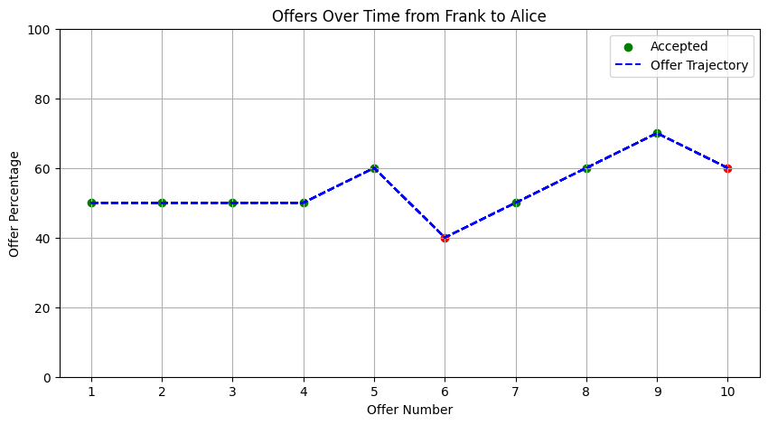

# Ultimatum game

## Settings

1. **Two Players**: Both players will be created with randomized personalities.
2. **Rules and Strategies**: The rules of the Ultimatum Game and possible strategies will be included in the shared memories of both players, but they will not be forced to follow any specific strategy.
3. **Hourly Offers**: Each hour, a fixed sum (e.g., $10) will be proposed by one player, who will then consider the split. The receiving player will then decide whether to accept or reject the offer.
4. **Data Recording**: We will record the offers made, offers accepted or rejected, and the players' accumulated money.
5. **Duration**: The simulation will last for 10 hours, resulting in 10 offers being made and decided upon.
6. **Database Storage**: The results will be stored in a database, and multiple simulations with different personalities will be run to gather comprehensive data.

## Results

Based on the datasets of simulation results ([`df_results0`](ultimatum_game_without_env_steps.csv) and [`df_results1`](ultimatum_game_with_env_steps.csv)) for the Ultimatum Game simulation, here is an analysis of the results along with some key observations. This will help in understanding the divergence from the expected outcomes and guiding future steps in the project:

### Summary of Observations

1. **Uniformity in Offers**:
   - In `df_results0`, where no time was allowed between offers, the offers made by Dana to Charlie are consistently 50%. This contradicts the expectation that proposers vary their offers based on the responses received and might indicate a lack of adaptive strategies or depth in the agent's decision-making processes.
   - In `df_results1`, where there was a 1-hour gap between questions, there is slightly more variation in the offers made by the proposers. However, the offers still hover around 50-60%, except for a few outliers.

2. **Acceptance Patterns**:
   - Offers in `df_results0` are universally accepted, regardless of the percentage, which is unexpected and suggests that the responder agents may not be effectively evaluating the fairness of the offers.
   - `df_results1` shows a more realistic pattern where some offers are rejected, but the criteria for acceptance appear inconsistent and do not clearly correlate with the offer amounts.

3. **Lack of Strategy**:
   - Both datasets suggest a lack of strategic depth in the agents' behavior. The consistency in the offers and the acceptance of low offers in some cases do not align with typical human play observed in studies of the Ultimatum Game, where lower offers are more likely to be rejected.

### Interpretation and Implications

Our approach of constructing agents from scratch and assigning them the task of playing the Ultimatum Game did not yield results that align closely with established human behavioral patterns in similar settings. This may be attributed to several factors:

- **Agent Design**: The randomized personalities may not have been sufficiently nuanced to reflect realistic decision-making and risk-assessment capabilities.
- **Rules and Strategies Understanding**: Although both players had shared memories of the rules and possible strategies, they might not have had the computational sophistication needed to utilize this information effectively.
- **Game Dynamics**: The static nature of the game setup and the simplicity of the decision matrix may not have provided enough complexity for emergent strategies to develop.

### Next Steps

Given these observations, the following steps are recommended to improve the simulation and get closer to realistic human-like behaviors:

1. **Enhance Agent Complexity**: Develop more complex decision-making algorithms for the agents, possibly integrating machine learning models that can adapt and learn from each round of the game.
   
2. **Dynamic Interaction**: Introduce more dynamic interactions between the players, allowing them to "remember" past interactions and adjust their strategies based on outcomes and perceived intentions of the other player.

3. **Incorporate Behavioral Economics**: Utilize principles from behavioral economics to imbue the agents with more realistic biases and decision-making processes.

4. **Cultural and Social Factors**: Consider including variables that simulate different cultural and social backgrounds to see how these factors influence decision-making in the game.

5. **Simulation Refinement**: Run the simulation multiple times with incremental adjustments to the agents' algorithms to better understand the necessary conditions for achieving realistic outcomes.

By implementing these changes, we hope to enhance the fidelity of the simulation, allowing it to generate results that more closely mimic the complex behaviors observed in human participants of the Ultimatum Game.